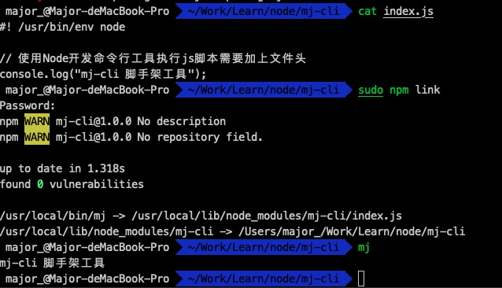

## 1 前言
在工作过程中，我们常常会从一个项目工程复制代码到一个新的项目，改项目配置信息、删除不必要的代码。这样做的效率比较低，也挺繁琐，更不易于分享协作。所以，我们可以制作一个cli工具，用来快速创建一个新项目的脚手架。如vue-cli, create-react-cli等一系列非常好用的cli工具。

## 1 简单演示
创建文件夹mj-cli,进入目录创建index.js,内容如下
```javascript
#!/usr/bin/env node
console.log('mj-cli脚手架工具');
```

执行npm init -y package.json文件，并在文件中 加入bin字段指向index.js:
```javascript
{
  "name": "mj-cli",
  "version": "1.0.0",
  "description": "",
  "main": "index.js",
  "scripts": {
    "test": "echo \"Error: no test specified\" && exit 1"
  },
  "keywords": [],
  "author": "",
  "license": "ISC",
  "bin": {
    "mj": "index.js"
  },
  "dependencies": {
}

```

执行npm link(mac下执行sudo npm link), 再执行mj命令便会在控制台输出“mj-cli脚手架工具”信息


## 2 脚手架开发
### 2.1 命令行工具参数设计
```javascript
1.mj -h | --help 查看帮助   
2.mj V | --version 查看版本   
3.mj list 列出所有模版列表
4.mj init <template-name> <project> 创建项目模版
```
### 2.2 实现设计命令行
1.项目结构
```
.
├── README.md
├── index.js // 入口
├── lib
│   ├── tplInit.js // init命令响应类
│   └── tplList.js // 模版list数据
├── package-lock.json
└── package.json

1 directory, 6 files
```

index.js代码
```javascript  
const program = require('commander');
const chalk = require('chalk');
const logSymbols = require('log-symbols');
const tplList = require('./lib/tplList');
const tplInit = require('./lib/tplInit');
const version = require('./package.json').version;

// mj -V | mj --version
program
    .version(version)

// mj init <template-name> <project-name>
program
    .command('init <template> <project>')
    .description('初始化项目模版')
    .action((template, project) => {
        // 根据模版名下载对应模版，并以project为本地项目名
        const { downloadUrl } = tplList[template];
        tplInit.downloadFun(downloadUrl, project).then(() => {
            tplInit.inquirerFun(project)
                .then(() => {
                    console.log(logSymbols.success, chalk.yellow('项目初始化成功'));
                })
                .catch(err => {
                    console.log(logSymbols.error, chalk.red('项目初始化失败'));
                })
        }).catch(err => {})
    });

// mj list
program
    .command('list')
    .description('查看所有模版')
    .action(() => {
        // 打印所有模版
        for (let i in tplList) {
            console.log(logSymbols.info, chalk.blue(`${i} ${tplList[i].description}`));
        }
    });

program.parse(process.argv);   
```

tplList.js
```javascript
const tplList = {
    'tpl-a':{
        'url': 'https://github.com/Major9506/vue-todos.git',
        'downloadUrl': 'http://github.com:Major9506/vue-todos#master',
        'description': '测试模版a'
    },
    'tpl-b':{
        'url': 'https://github.com/Major9506/vue-todos.git',
        'downloadUrl': 'http://github.com:Major9506/vue-todos#master',
        'description': '测试模版b'
    }
}

module.exports = tplList;
```

tplInit.js
```javascript
const download = require('download-git-repo');
const ora = require('ora');
const handlebars = require('handlebars');
const fs = require('fs');
const inquirer = require('inquirer');

const tplInit = {
    // 下载远端模版
    downloadFun(downloadUrl, project) {
        return new Promise((resolve, reject) => {
            const spinner = ora('正在下载模版...').start();
            download(downloadUrl, project, { clone: true }, function (err) {
                if (err) {
                    spinner.fail(); // 下载失败提示
                    reject(err);
                    return;
                }
                spinner.succeed(); // 下载成功提示
                resolve();
            })
        })

    },

    // 处理用户交互
    inquirerFun(project) {
        return inquirer
            .prompt([
                {
                    type: "input",
                    name: "name",
                    message: "请输入项目名称:"
                },
                {
                    type: "input",
                    name: "description",
                    message: "请输入项目简介:"
                },
                {
                    type: "input",
                    name: "author",
                    message: "请输入项目作者:"
                }
            ])
            .then(answers => {
                const packagePath = `${project}/package.json`;
                const packageContent = fs.readFileSync(packagePath, 'utf8');
                const packageResult = handlebars.compile(packageContent)(answers);
                fs.writeFileSync(packagePath, packageResult);
            })
    }
}

module.exports = tplInit;
```

### 2.3 发布npm包
1.访问npmjs.org，注册账号
2.执行npm login 登录
3.执行npm publish --access public 发布包


